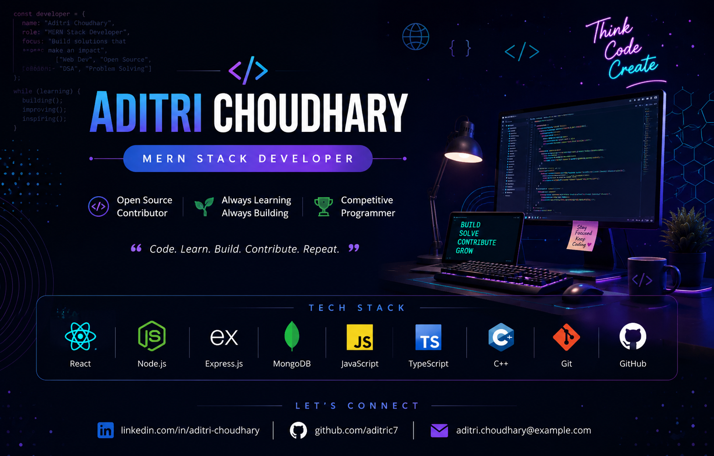

  

  

<h1 align="center">Hi 👋, I'm Aditri</h1>

<h3 align="center">
Aspiring Full Stack Developer • MERN Stack • Competitive Programmer
</h3>

🎓 B.Tech Computer Science Engineering Student  
🌱 Currently learning React, Node.js, Express.js & MongoDB  
🚀 GSSoC 2026 Contributor | DSA Enthusiast

---

## 🚀 Current Focus

- 🌾 Building **Krishi Market** (MERN Stack)
- 💻 Contributing to **GSSoC 2026**
- 📚 Solving Data Structures & Algorithms
- ⚡ Improving Full Stack Development Skills

---

## 💻 Tech Stack

## 🏆 GitHub Trophies

---
## 🚀 Featured Projects

### 🌾 Krishi Market
A MERN Stack marketplace connecting farmers directly with consumers.

### 🍔 Food Ordering Website
Responsive React application for browsing and ordering food.

### 💻 Open Source
Actively contributing to GSSoC 2026.

---

## 📊 GitHub Stats

  

## 📫 Connect With Me

- 📧 Email: **aditrichoudhary2@gmail.com**
- 💼 LinkedIn: https://www.linkedin.com/in/aditri-choudhary-996263325
- 💻 GitHub: https://github.com/aditric7

---

⭐ Thanks for visiting my profile!
